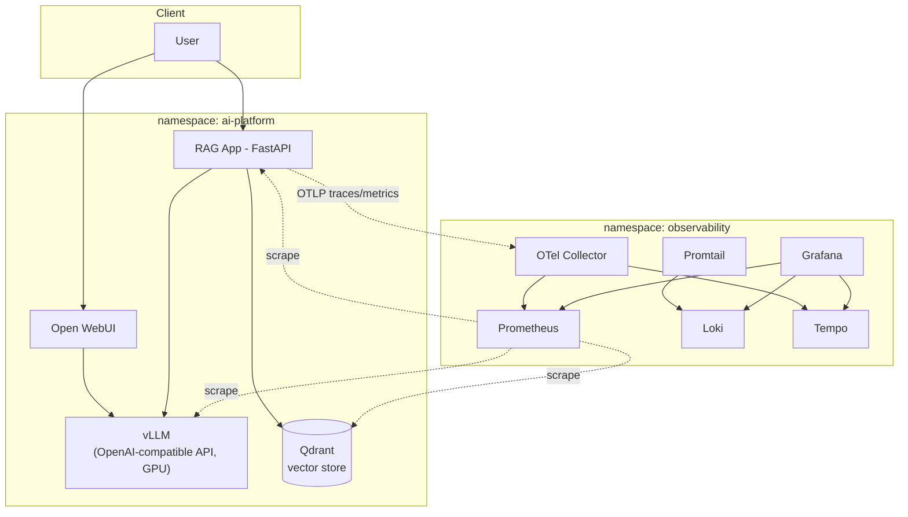

# Architecture

## Overview

A single GPU-backed Kubernetes node (MicroK8s) hosts two logical
namespaces: `ai-platform` for the inference/RAG workloads, and
`observability` for metrics, logs, and traces.

## Request flow: RAG query

1. Client calls `POST /query` on the RAG app with a question.
2. The RAG app embeds the question (`fastembed`, `BAAI/bge-small-en-v1.5`) and searches Qdrant for the top-k nearest chunks.
3. Retrieved chunks are assembled into a context block and sent to vLLM's `/v1/chat/completions` endpoint as a system + user message.
4. vLLM generates a grounded answer, which the RAG app returns alongside the source chunks used.
5. The whole request is traced end to end via OpenTelemetry, exported to the OTel Collector, and stored in Tempo; Prometheus scrapes latency/throughput metrics from the RAG app, vLLM, and Qdrant directly.

## Why these components

- **vLLM** — high-throughput, OpenAI-API-compatible serving with PagedAttention, so any OpenAI SDK client (Open WebUI, the RAG app) works unmodified.
- **Qdrant** — lightweight, single-binary vector database with a native gRPC/HTTP API and payload filtering, avoiding a heavier managed dependency.
- **fastembed** — CPU-only embedding generation, keeping the GPU dedicated to the LLM rather than splitting it with an embedding model.
- **Prometheus + Grafana** — pull-based metrics scraping via pod annotations, so any new workload is auto-discovered by adding `prometheus.io/scrape: "true"`.
- **Loki + Promtail** — log aggregation that indexes only labels (not full text), keeping storage cost low for a single-node deployment.
- **Tempo + OTel Collector** — a vendor-neutral OTLP ingestion point in front of Tempo, so instrumentation in application code never has to change if the tracing backend does.

## Namespaces and storage

| Namespace | Workloads | Persistent data |
|---|---|---|
| `ai-platform` | vLLM, Open WebUI, Qdrant, RAG app | model weights cache, Open WebUI state, Qdrant collections |
| `observability` | Prometheus, Grafana, Loki, Promtail, Tempo, OTel Collector | Prometheus TSDB, Grafana DB, Loki chunks, Tempo blocks |

All persistent volumes use the `microk8s-hostpath` storage class (single-node, local disk) — see [`manifests/`](../manifests) for the concrete `PersistentVolumeClaim` definitions per component.
